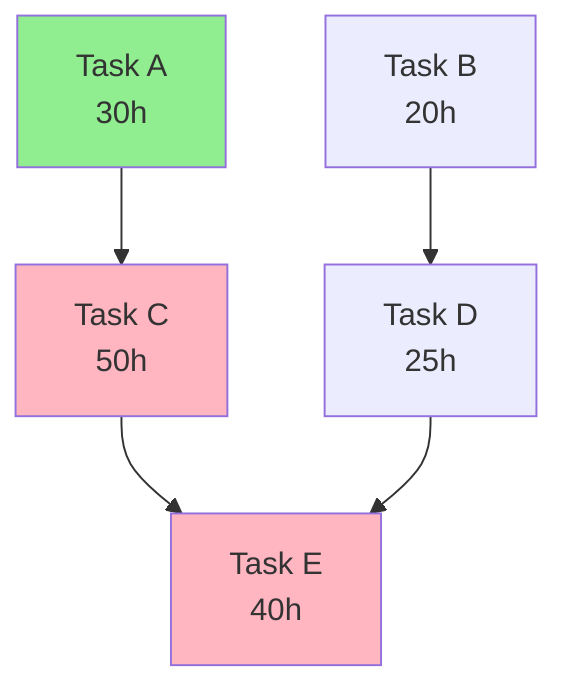

# Dependency Resolution Reference

## Overview

Dependency resolution validates the task dependency graph, detects cycles, computes execution levels, and identifies the critical path. This reference covers algorithms and patterns for robust dependency management.

## Dependency Graph Representation

### Input Format (initiative.yml)

```yaml
tasks:
  - id: task-1
    dependencies: []  # No dependencies

  - id: task-2
    dependencies: [task-1]  # Depends on task-1

  - id: task-3
    dependencies: [task-1]  # Also depends on task-1

  - id: task-4
    dependencies: [task-2, task-3]  # Depends on both task-2 and task-3
```

### Internal Representation

**Adjacency List** (forward dependencies):
```javascript
{
  'task-1': [],
  'task-2': ['task-1'],
  'task-3': ['task-1'],
  'task-4': ['task-2', 'task-3']
}
```

**Reverse Graph** (what depends on me):
```javascript
{
  'task-1': ['task-2', 'task-3'],
  'task-2': ['task-4'],
  'task-3': ['task-4'],
  'task-4': []
}
```

---

## Cycle Detection

### Purpose

Ensure no circular dependencies that would cause deadlock (A depends on B, B depends on A).

### Algorithm: Depth-First Search with Coloring

```
Initialize:
  color = {}  # white: 0, gray: 1, black: 2
  for each task: color[task] = 0 (white)

Function has_cycle(task):
  if color[task] == 1 (gray):
    return True  # Back edge found, cycle exists

  if color[task] == 2 (black):
    return False  # Already processed

  color[task] = 1 (gray)  # Mark as being processed

  for each dependency in task.dependencies:
    if has_cycle(dependency):
      return True

  color[task] = 2 (black)  # Mark as fully processed
  return False

Main:
  for each task:
    if color[task] == 0 (white):
      if has_cycle(task):
        return "Cycle detected"

  return "No cycle"
```

### Example

**Valid Graph** (No Cycle):
```
A → B → C
↓
D → E
```

**Invalid Graph** (Has Cycle):
```
A → B
↑   ↓
D ← C
```
Cycle: A → B → C → D → A

### Cycle Reporting

```
When cycle detected:
1. Identify cycle path (trace back through gray nodes)
2. Create human-readable cycle description:
   "Cycle detected: task-A → task-B → task-C → task-A"
3. List all tasks involved in cycle
4. Suggest breaking one dependency to resolve

Error message:
  "Circular dependency detected in initiative

  Cycle path: Database Migration (task-1) →
              API Implementation (task-2) →
              Database Schema Update (task-3) →
              Database Migration (task-1)

  Tasks involved: task-1, task-2, task-3

  Resolution: Remove or redirect one of these dependencies
  to break the cycle. Consider if task-3 truly needs task-1,
  or if dependency order can be adjusted."
```

---

## Topological Sort

### Purpose

Order tasks such that all dependencies come before dependents. Required for sequential execution strategy.

### Algorithm: Kahn's Algorithm

```
Initialize:
  in_degree = {}  # Count of incoming edges
  for each task:
    in_degree[task] = count of dependencies

  queue = []  # Tasks with no dependencies
  for each task:
    if in_degree[task] == 0:
      queue.append(task)

  sorted_order = []

Loop:
  while queue not empty:
    task = queue.pop_front()
    sorted_order.append(task)

    for each dependent in reverse_graph[task]:
      in_degree[dependent] -= 1
      if in_degree[dependent] == 0:
        queue.append(dependent)

Result:
  if length(sorted_order) == total_tasks:
    return sorted_order  # Success
  else:
    return "Cycle exists"  # Some tasks never reached
```

### Example

**Input**:
```
A → C
B → C
C → D
```

**In-Degree**:
```
A: 0, B: 0, C: 2, D: 1
```

**Execution**:
```
Step 1: Queue = [A, B], Sorted = []
Step 2: Process A, Queue = [B], Sorted = [A], C in-degree: 2→1
Step 3: Process B, Queue = [], Sorted = [A, B], C in-degree: 1→0, add C
Step 4: Queue = [C], Sorted = [A, B]
Step 5: Process C, Queue = [], Sorted = [A, B, C], D in-degree: 1→0, add D
Step 6: Queue = [D], Sorted = [A, B, C]
Step 7: Process D, Queue = [], Sorted = [A, B, C, D]

Result: [A, B, C, D] (valid topological order)
```

**Output**: [A, B, C, D] or [B, A, C, D] (both valid, A and B interchangeable)

---

## Level Computation (For Mixed/Parallel Strategy)

### Purpose

Group tasks by dependency level to enable parallel execution within levels.

### Algorithm: Breadth-First Search

```
Initialize:
  level = {}
  queue = []

  # Start with tasks that have no dependencies
  for each task:
    if task.dependencies is empty:
      level[task] = 0
      queue.append(task)

Loop:
  while queue not empty:
    task = queue.pop_front()
    current_level = level[task]

    for each dependent in reverse_graph[task]:
      # Dependent's level = max of all dependency levels + 1
      max_dep_level = max([level[dep] for dep in dependent.dependencies])
      dependent_level = max_dep_level + 1

      if dependent not in level:
        level[dependent] = dependent_level
        queue.append(dependent)
      else:
        # Update if we found a longer path
        if dependent_level > level[dependent]:
          level[dependent] = dependent_level
          queue.append(dependent)  # Re-process

Result:
  Group tasks by level:
  {
    level-0: [tasks with level 0],
    level-1: [tasks with level 1],
    ...
  }
```

### Example

**Dependency Graph**:
```
A → C → E
B → D → F
    ↓
    E
```

**Level Assignment**:
```
Step 1: A and B have no dependencies
  level[A] = 0, level[B] = 0
  Queue: [A, B]

Step 2: Process A
  C depends on A (level 0)
  level[C] = 0 + 1 = 1
  Queue: [B, C]

Step 3: Process B
  D depends on B (level 0)
  level[D] = 0 + 1 = 1
  Queue: [C, D]

Step 4: Process C
  E depends on C (level 1)
  level[E] = 1 + 1 = 2
  Queue: [D, E]

Step 5: Process D
  E depends on D (level 1)
  E already has level 2 (from C)
  level[E] remains 2 (max)
  F depends on D (level 1)
  level[F] = 1 + 1 = 2
  Queue: [E, F]

Step 6: Process E, F (no dependents)

Result:
  Level 0: [A, B]
  Level 1: [C, D]
  Level 2: [E, F]
```

**Execution**:
- Execute A and B in parallel
- Wait for both to complete
- Execute C and D in parallel
- Wait for both to complete
- Execute E and F in parallel
- Done

---

## Critical Path Identification

### Purpose

Find the longest path through the dependency graph to determine minimum timeline.

### Algorithm: Longest Path in DAG

```
Initialize:
  distance = {}  # Longest distance from start
  for each task:
    distance[task] = 0

Function compute_longest_path(task):
  if task.dependencies is empty:
    return task.estimated_hours

  max_path = 0
  for each dependency in task.dependencies:
    dep_path = compute_longest_path(dependency)
    if dep_path > max_path:
      max_path = dep_path

  distance[task] = max_path + task.estimated_hours
  return distance[task]

Main:
  for each task:
    compute_longest_path(task)

  # Find task(s) with maximum distance
  max_distance = max(distance.values())
  end_tasks = [task for task in tasks if distance[task] == max_distance]

  # Trace back critical path
  critical_path = trace_path(end_tasks[0])

  return critical_path, max_distance
```

### Example

**Dependency Graph** (with estimated hours):
```
A (30h) → C (50h) → E (40h)
B (20h) → D (25h) ↗
```

**Distance Calculation**:
```
distance[A] = 30
distance[B] = 20
distance[C] = 30 + 50 = 80
distance[D] = 20 + 25 = 45
distance[E] = max(80, 45) + 40 = 120

Critical path: A → C → E (120 hours)
```

### Critical Path Properties

- **Minimum timeline**: Cannot complete initiative faster than critical path
- **No slack**: Delays on critical path tasks delay entire initiative
- **High priority**: Critical path tasks should be prioritized
- **Bottleneck**: Focus optimization efforts here

### Slack Time Calculation

**Slack** = Latest start time - Earliest start time

```
For non-critical path tasks:
  earliest_start = When all dependencies complete
  latest_start = When dependent tasks need me to start

  slack = latest_start - earliest_start

Example:
  Task D (from above):
    Earliest: After B completes (20h)
    Latest: Before E needs to start (80h - 25h = 55h)
    Slack: 55 - 20 = 35 hours

Task D can be delayed up to 35 hours without impacting initiative timeline
```

---

## Dependency Validation

### Reference Validation

```
For each task in initiative.yml:
  For each dependency in task.dependencies:
    Check:
      ✓ Dependency task ID exists in initiative.yml
      ✓ Dependency task ID is valid (not empty, not self-reference)
      ✓ Dependency is not same as current task (no self-loops)

If any check fails:
  Error: "Invalid dependency reference in task [task-id]:
          Dependency '[dep-id]' does not exist"

Auto-fix:
  Attempt 1: Remove invalid dependency, log warning
  Attempt 2: Prompt user to fix manually
```

### Completeness Validation

```
Check:
  ✓ All tasks reachable from at least one Level 0 task (connected graph)
  ✓ No orphaned tasks (tasks with no path to/from others)

If orphaned tasks found:
  Warning: "Tasks [task-ids] are not connected to main graph.
           They will execute independently."

Action:
  - Still valid, but flag for user review
  - May indicate missing dependencies
```

### Consistency Validation

```
For each task:
  forward_deps = task.dependencies (from task metadata)
  reverse_deps = tasks that list this task in their blocks field

  Validate:
    ✓ If A in task.dependencies, then task in A.blocks
    ✓ If task in B.blocks, then B in task.dependencies

If inconsistency found:
  Auto-fix: Synchronize forward and reverse dependencies
  Prefer: Forward dependencies (task.dependencies) as source of truth
```

---

## Dependency Types

### Hard Dependencies (Must Complete)

```yaml
task-2:
  dependencies: [task-1]
  dependency_type: hard  # Default

Enforcement:
  - Task-2 CANNOT start until task-1 status == "completed"
  - If task-1 fails, task-2 remains blocked
  - No override possible
```

**Use Cases**:
- Database schema before API implementation
- Backend before frontend integration
- Core feature before enhancement

### Soft Dependencies (Should Complete)

```yaml
task-2:
  dependencies: [task-1]
  dependency_type: soft

Enforcement:
  - Warn if task-2 starts before task-1 completes
  - Allow user override (with confirmation)
  - Useful for documentation, testing tasks
```

**Use Cases**:
- Documentation can start before feature complete
- Testing can overlap with implementation

### Future Enhancement

Currently, all dependencies are **hard**. Soft dependencies are a future enhancement requiring:
- orchestrator-state.yml schema update (task section)
- Dependency checking logic update
- User prompt for override

---

## Dependency Graph Visualization

### ASCII Representation

```
Level 0 (Start):
  ┌─────────┐     ┌─────────┐
  │ Task A  │     │ Task B  │
  │ (30h)   │     │ (20h)   │
  └────┬────┘     └────┬────┘
       │               │
       ▼               ▼
Level 1:
  ┌─────────┐     ┌─────────┐
  │ Task C  │     │ Task D  │
  │ (50h)   │     │ (25h)   │
  └────┬────┘     └────┬────┘
       │               │
       └───────┬───────┘
               ▼
Level 2 (End):
       ┌─────────┐
       │ Task E  │
       │ (40h)   │
       └─────────┘

Critical Path: A → C → E (120h)
```

### Mermaid Diagram (Future)



---

## Dependency Resolution Checklist

### Phase 2 (Dependency Resolution) Validation

- [ ] **Cycle Detection**: Run DFS, ensure no cycles
- [ ] **Reference Validation**: All dependencies point to existing tasks
- [ ] **Topological Sort**: Generate valid ordering (if sequential)
- [ ] **Level Computation**: Assign levels (if parallel/mixed)
- [ ] **Critical Path**: Identify longest path
- [ ] **Consistency Check**: Forward and reverse deps synchronized
- [ ] **Completeness Check**: All tasks reachable
- [ ] **Slack Calculation**: Compute slack for non-critical tasks
- [ ] **Visualization**: Generate ASCII dependency graph
- [ ] **State Save**: Write execution plan to initiative-state.yml

---

## Common Dependency Patterns

### Linear Chain

```
A → B → C → D

Levels: 4 (each task is own level)
Critical Path: A → B → C → D (entire chain)
Parallelism: None
Strategy: Sequential
```

### Star (Fan-Out)

```
    A
   /|\
  B C D

Levels: 2 (Level 0: A, Level 1: B, C, D)
Critical Path: A → [longest of B/C/D]
Parallelism: High (B, C, D can run together)
Strategy: Parallel or Mixed
```

### Inverse Star (Fan-In)

```
  B C D
   \|/
    A

Levels: 2 (Level 0: B, C, D, Level 1: A)
Critical Path: [longest of B/C/D] → A
Parallelism: High (B, C, D can run together)
Strategy: Parallel or Mixed
```

### Diamond

```
    A
   / \
  B   C
   \ /
    D

Levels: 3 (0: A, 1: B/C, 2: D)
Critical Path: A → [longest of B/C] → D
Parallelism: Medium (B and C can run together)
Strategy: Mixed
```

### Parallel Chains

```
A → B → C
D → E → F

Levels: 3 (0: A/D, 1: B/E, 2: C/F)
Critical Path: Longer of the two chains
Parallelism: High (chains independent)
Strategy: Parallel
```

### Complex DAG

```
A → C → F
B → D → G
C → E → G
D → E

Multiple paths, multiple levels
Levels: Computed via BFS
Critical Path: Computed via longest path algorithm
Parallelism: Varies by level
Strategy: Mixed (recommended)
```

---

## Error Cases and Handling

### Cycle Detected

```
Error: Cannot proceed
Message: Detailed cycle path
Action: Prompt user to manually fix initiative.yml
Recovery: None (auto-fix impossible)
```

### All Tasks Blocked

```
Error: No Level 0 tasks (all have dependencies)
Message: "Every task depends on something, but nothing can start"
Action: Prompt user to check dependencies
Recovery: None (structural issue)
```

### Orphaned Tasks

```
Warning: Tasks not connected to main graph
Message: List of orphaned task IDs
Action: Flag for user review, but continue
Recovery: Not needed (valid but potentially incorrect)
```

### Invalid Reference

```
Error: Dependency points to non-existent task
Message: "Task [task-id] references unknown dependency [dep-id]"
Action: Remove invalid dependency, log warning
Recovery: Attempt 1-2 times
```

---

## Performance Considerations

### Algorithm Complexity

| Algorithm | Complexity | Notes |
|-----------|------------|-------|
| Cycle Detection (DFS) | O(V + E) | V = tasks, E = dependencies |
| Topological Sort (Kahn) | O(V + E) | Linear in graph size |
| Level Computation (BFS) | O(V + E) | Single pass through graph |
| Critical Path | O(V + E) | DFS with memoization |

**For typical initiatives**:
- V = 3-15 tasks
- E = 5-30 dependencies
- All algorithms complete in <1 second

### Optimization

- **Memoization**: Cache longest path calculations
- **Early termination**: Stop DFS on first cycle found
- **Lazy evaluation**: Only compute critical path if needed

---

## Testing Dependency Resolution

### Test Cases

**Valid Graphs**:
- Linear chain (A→B→C)
- Star (A→[B,C,D])
- Diamond (A→[B,C]→D)
- Multiple chains
- Complex DAG

**Invalid Graphs**:
- Self-loop (A→A)
- Two-node cycle (A→B→A)
- Three-node cycle (A→B→C→A)
- All tasks blocked (no Level 0)

**Edge Cases**:
- Single task (no dependencies)
- Two independent tasks
- Maximum depth (6+ levels)
- Maximum breadth (10+ parallel tasks)

---

## Summary

Dependency resolution involves:

1. **Cycle Detection**: Ensure no circular dependencies (DFS)
2. **Topological Sort**: Order tasks for sequential execution (Kahn's)
3. **Level Computation**: Group tasks for parallel execution (BFS)
4. **Critical Path**: Find longest path for timeline estimation (Longest Path)
5. **Validation**: Ensure references valid, graph connected, consistent

**Key Algorithms**:
- DFS for cycle detection
- Kahn's algorithm for topological sort
- BFS for level assignment
- Dynamic programming for critical path

**Output**: Validated dependency graph with execution strategy

For execution patterns, see `execution-strategies.md`.
For state management, see `state-coordination.md`.
